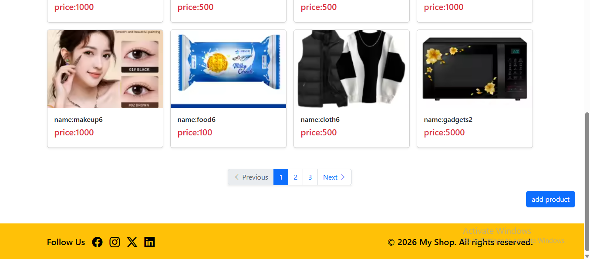
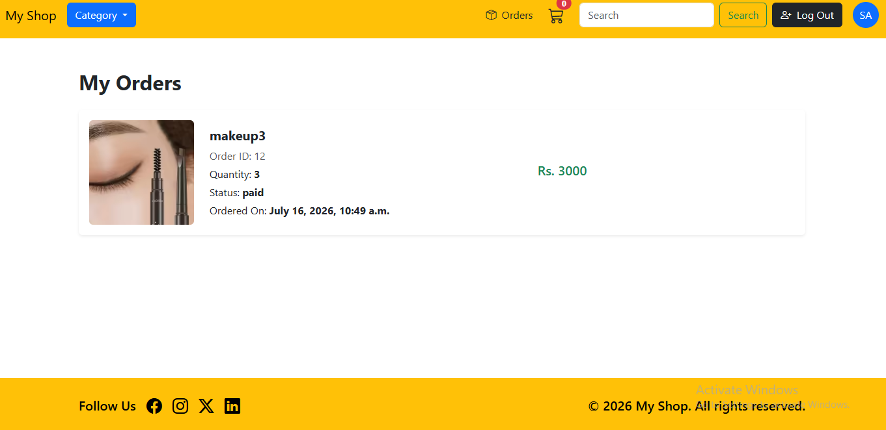
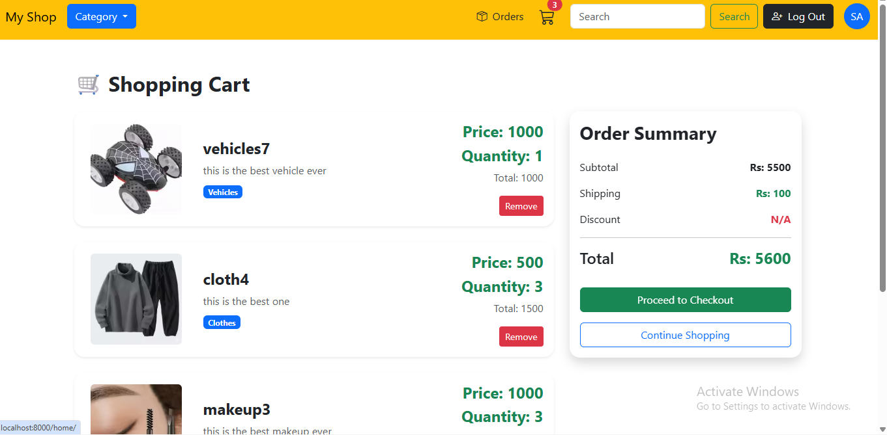
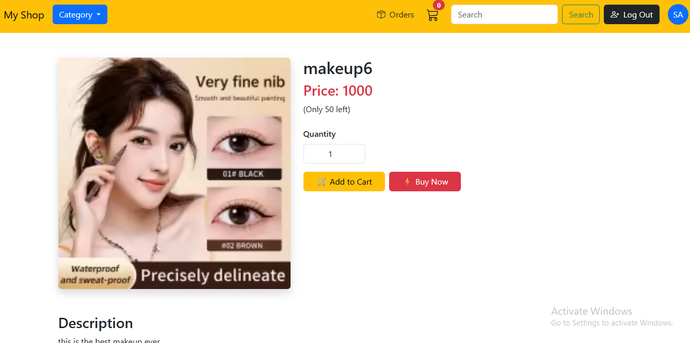

# ShopEase — Django E-Commerce Website

A full-featured e-commerce web application built with Django, featuring cart & "Buy Now" checkout flows, secure payment confirmation, order history, product search with pagination, and Google OAuth login.




## Features

- 🔐 User authentication — email/password login + "Continue with Google" (OAuth via django-allauth)
- 🛒 Cart and "Buy Now" checkout flows, both feeding into a unified Order/OrderItem model
- 💳 Idempotent payment processing — prevents duplicate charges if a user hits Back/refreshes after paying
- 📦 Order history — view all past paid orders per user
- 🔍 Product search by name, with pagination that preserves the search term across pages
- 🔄 Random product ordering on the homepage, so one category doesn't dominate a page
- ⚡ Atomic stock updates using Django's `F()` expressions to prevent race conditions on concurrent purchases
- 🛍️ Live cart item count shown on every page via a custom context processor

## Tech Stack

- **Backend:** Python, Django
- **Database:** SQLite (development)
- **Frontend:** HTML, Bootstrap
- **Auth:** django-allauth (Google OAuth)

## Screenshots





## Setup & Installation

1. **Clone the repository**
```bash
   git clone https://github.com/your-username/your-repo-name.git
   cd your-repo-name
```

2. **Create and activate a virtual environment**
```bash
   python -m venv myvenv
   myvenv\Scripts\activate      # Windows
   source myvenv/bin/activate   # macOS/Linux
```

3. **Install dependencies**
```bash
   pip install -r requirements.txt
```

4. **Set up environment variables**

   Create a `.env` file in the project root:
SECRET_KEY=your-secret-key-here
DEBUG=True
GOOGLE_CLIENT_ID=your-google-client-id
GOOGLE_CLIENT_SECRET=your-google-client-secret


5. **Run migrations**
```bash
   python manage.py migrate
```

6. **Create a superuser (optional, for admin access)**
```bash
   python manage.py createsuperuser
```

7. **Run the development server**
```bash
   python manage.py runserver
```

8. Visit `http://localhost:8000` in your browser.

## What I Learned

This was my first full end-to-end Django project. Along the way, I learned:

- The POST → Redirect → GET pattern, and why it matters for preventing duplicate form submissions
- The difference between GET and POST, and when CSRF protection actually applies
- Using `F()` expressions for atomic, race-condition-safe database updates
- Building reusable context processors for data needed across every page
- Handling session vs. database-backed data (Buy Now vs. Cart checkout)
- Setting up Google OAuth login end-to-end, including debugging redirect URI mismatches
- Writing paginated, searchable views while preserving query parameters across page links

## License

This project is open source and available .